# AEM URL Converter: Zero to Hero Tutorial

## Table of Contents
1. [Introduction & Prerequisites](#introduction--prerequisites)
2. [Understanding the Problem](#understanding-the-problem)
3. [System Architecture Overview](#system-architecture-overview)
4. [Core Concepts Deep Dive](#core-concepts-deep-dive)
5. [Code Walkthrough](#code-walkthrough)
6. [Data Flow Analysis](#data-flow-analysis)
7. [Hands-on Examples](#hands-on-examples)
8. [Advanced Customization](#advanced-customization)
9. [Troubleshooting Guide](#troubleshooting-guide)
10. [Best Practices & Production Tips](#best-practices--production-tips)

---

## Introduction & Prerequisites

### What You'll Learn
By the end of this tutorial, you'll understand:
- How GlobalLink translation packages work
- AEM MSM (Multi-Site Manager) URL structure
- Python file processing and data transformation
- Streamlit web application development
- Real-world enterprise translation workflow

### Prerequisites
- Basic Python knowledge (functions, loops, dictionaries)
- Understanding of file systems and ZIP archives
- Familiarity with web URLs
- Basic HTML/CSS knowledge (helpful but not required)

### The Business Problem
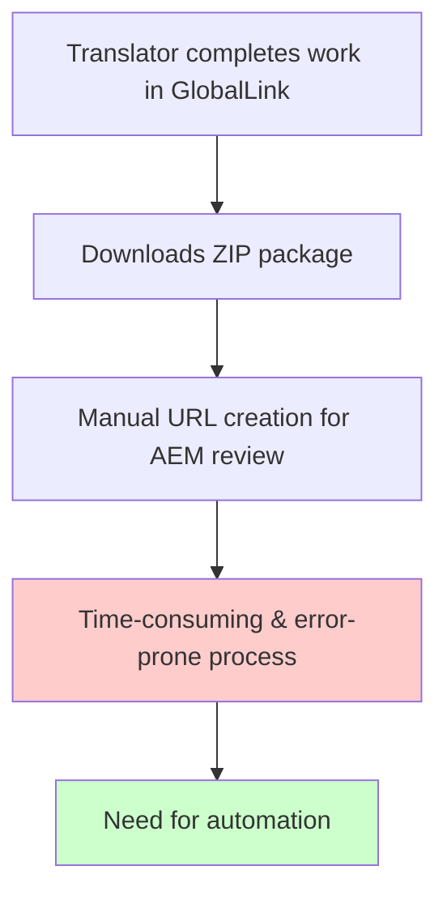

---

## Understanding the Problem

### What is GlobalLink?
GlobalLink is a Translation Management System (TMS) used by enterprises to manage multilingual content. When translators complete their work, they generate ZIP packages containing translated files.

### What is AEM MSM?
Adobe Experience Manager's Multi-Site Manager allows companies to manage content across multiple sites and languages from a central location.

### The Challenge
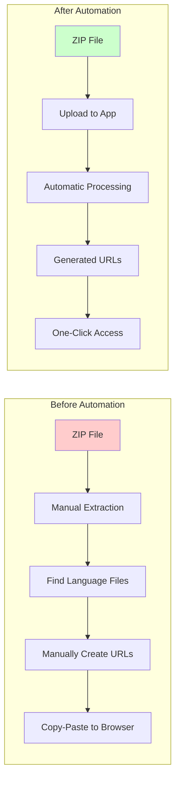

### File Structure Inside GlobalLink ZIP
```
translation_package.zip
├── project_info/
├── ko-KR/
│   ├── #content#language-master#ko#some#path#page.xml
│   ├── #content#language-master#ko#another#path#page.xml
│   └── ...
├── ja-JP/
│   ├── #content#language-master#ja#some#path#page.xml
│   ├── #content#language-master#ja#another#path#page.xml
│   └── ...
└── metadata/
```

---

## System Architecture Overview

### High-Level Architecture
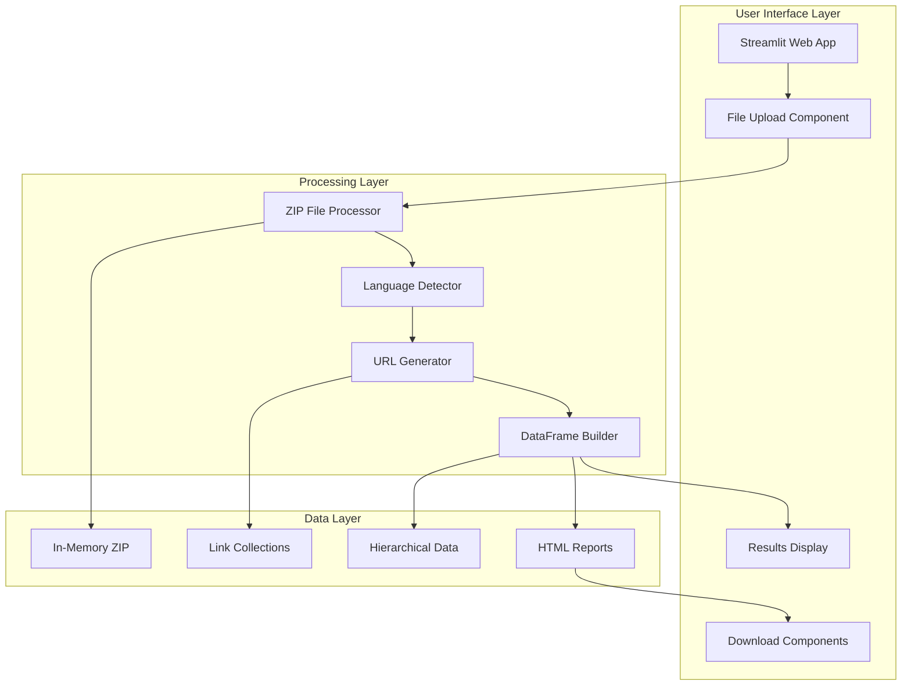

### Monolithic Design Philosophy
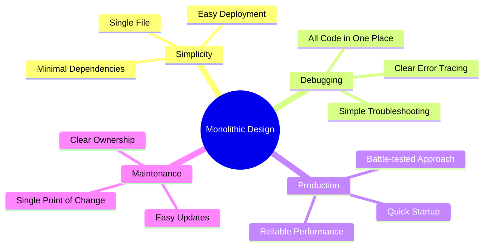

---

## Core Concepts Deep Dive

### 1. File Name Transformation Logic

#### Input File Name
```
#content#language-master#en#products#diagnostic-systems#nextseq-1000-2000.xml
```

#### Transformation Process
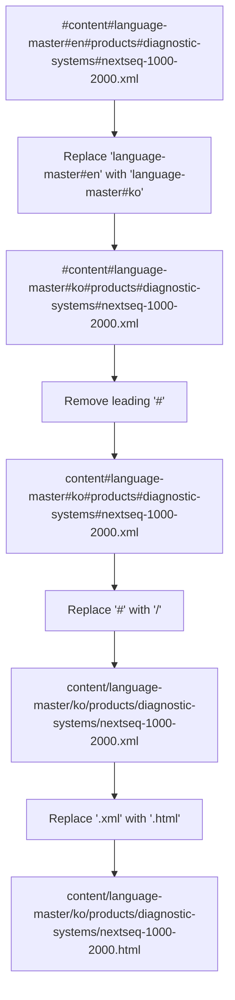

#### Final URL Construction
```
https://prod-author.illumina.com/editor.html/content/language-master/ko/products/diagnostic-systems/nextseq-1000-2000.html
```

### 2. Language Detection Algorithm
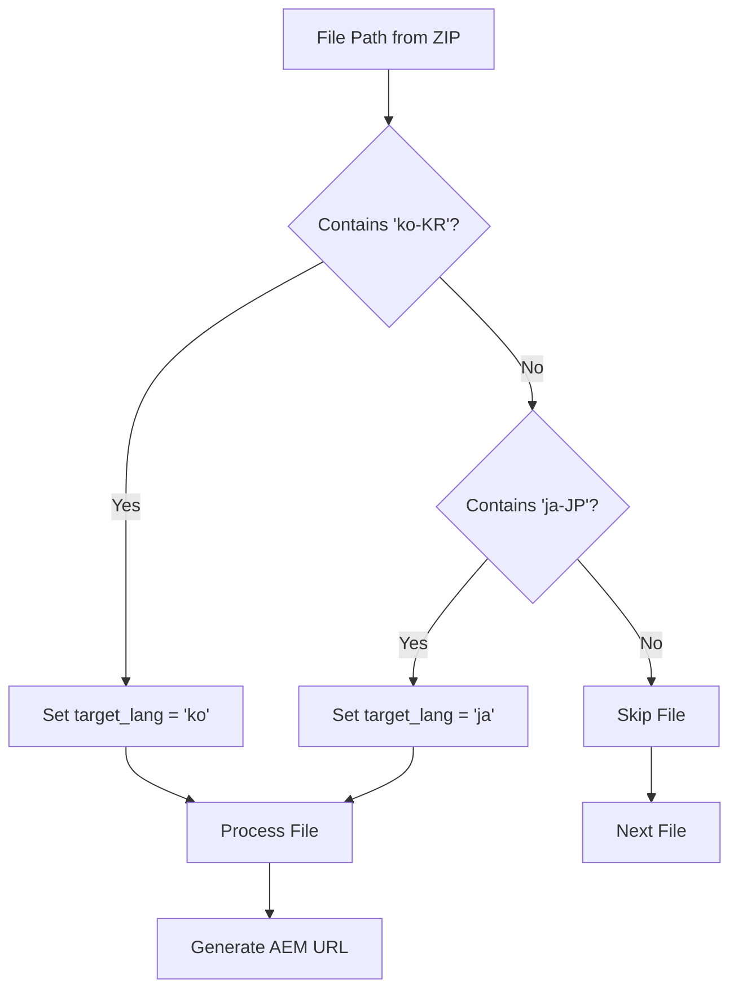

### 3. MSM Quick Links Generation
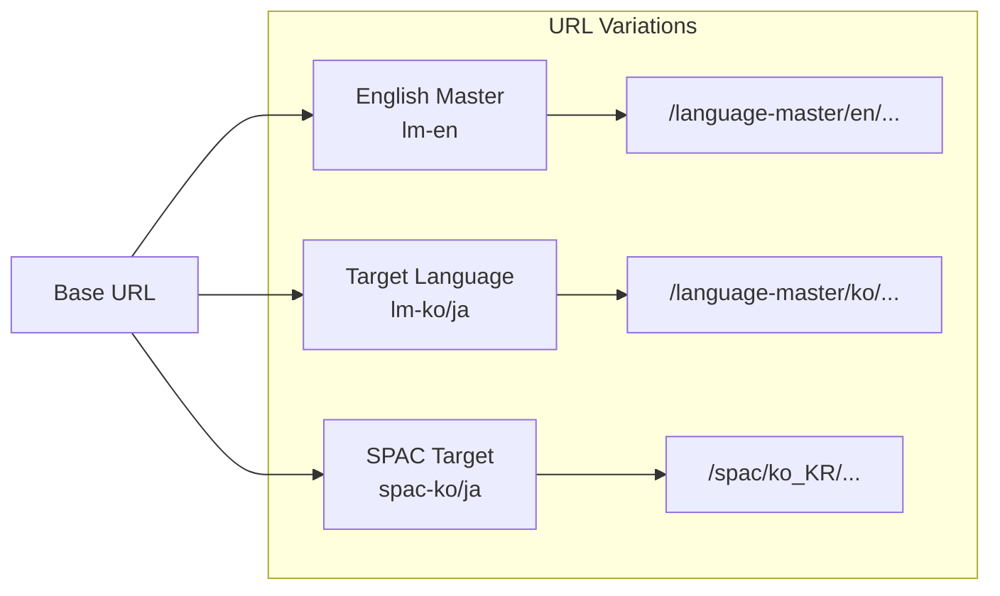

---

## Code Walkthrough

### 1. Configuration Section
```python
# Global Configuration
AEM_HOST = "https://prod-author.illumina.com"
SOURCE_LANG_PATH = "language-master#en"
TEMPLATE_FILE = "html_template_file.html"
```

**Why these values?**
- `AEM_HOST`: Production AEM author environment
- `SOURCE_LANG_PATH`: Standard English master path pattern
- `TEMPLATE_FILE`: Customizable HTML template for reports

### 2. Core Function: generate_aem_url()

#### Function Flow
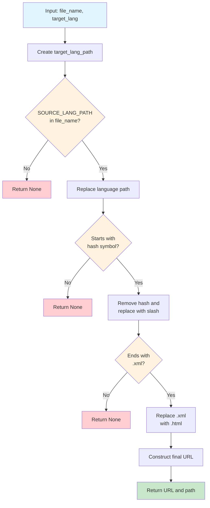

#### Code Breakdown
```python
def generate_aem_url(file_name: str, target_lang: str) -> Optional[Tuple[str, str]]:
    # Step 1: Create target language path
    target_lang_path = f"language-master#{target_lang}"

    # Step 2: Validate source language exists
    if SOURCE_LANG_PATH not in file_name:
        return None

    # Step 3: Replace language in path
    target_file_name = file_name.replace(SOURCE_LANG_PATH, target_lang_path)

    # Step 4: Validate format
    if not target_file_name.startswith('#'):
        return None

    # Step 5: Transform to AEM path
    aem_path = target_file_name[1:].replace('#', '/')

    # Step 6: Convert XML to HTML
    if aem_path.endswith('.xml'):
        aem_path = aem_path[:-4] + '.html'
    else:
        return None

    # Step 7: Build final URL
    final_url = f"{AEM_HOST}/editor.html/{aem_path}"
    return final_url, aem_path
```

### 3. ZIP Processing Logic

#### Process Flow
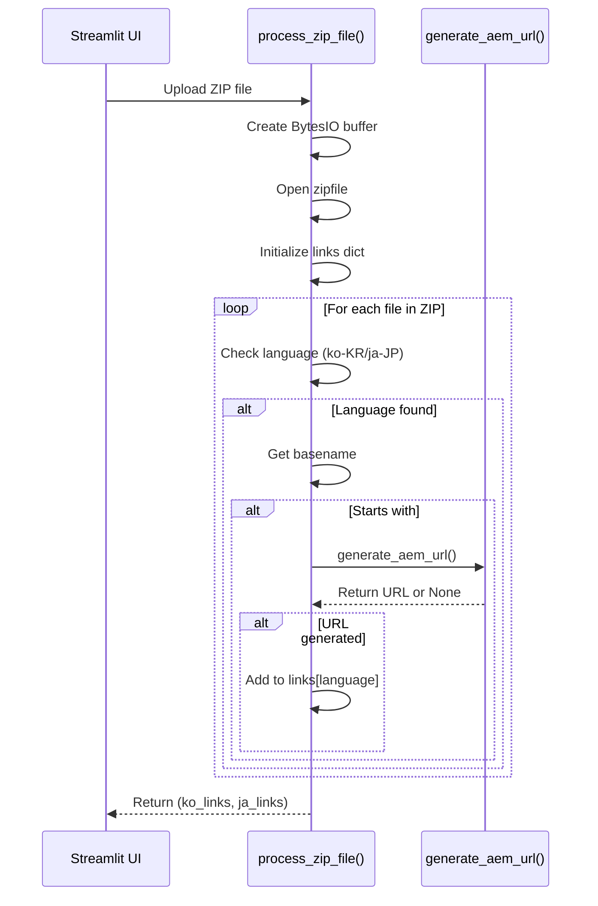

### 4. Data Structure Evolution

#### Raw Data
```python
# Input from ZIP
file_paths = [
    "ko-KR/#content#language-master#en#products#page1.xml",
    "ko-KR/#content#language-master#en#products#page2.xml",
    "ja-JP/#content#language-master#en#products#page1.xml"
]
```

#### Processed Links
```python
# After URL generation
links = {
    'ko': [
        {
            'url': 'https://prod-author.illumina.com/editor.html/content/language-master/ko/products/page1.html',
            'path': 'content/language-master/ko/products/page1.html'
        },
        {
            'url': 'https://prod-author.illumina.com/editor.html/content/language-master/ko/products/page2.html',
            'path': 'content/language-master/ko/products/page2.html'
        }
    ],
    'ja': [...]
}
```

#### Hierarchical DataFrame
```python
# After build_hierarchical_df()
df = pd.DataFrame({
    'Level 2': ['products', 'products'],
    'Level 3': ['[page1](url1)', '[page2](url2)']
})
```

---

## Data Flow Analysis

### Complete Data Flow Diagram
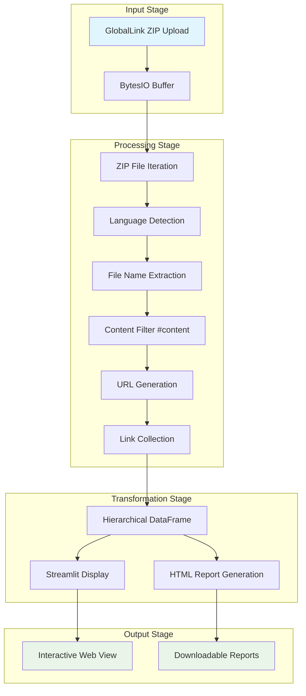

### Memory Usage Pattern
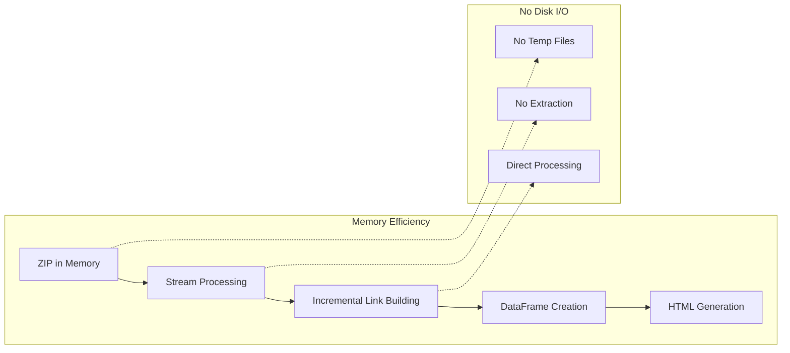

---

## Hands-on Examples

### Example 1: Basic File Processing

#### Input File
```
File: ko-KR/#content#language-master#en#products#systems#nextseq.xml
```

#### Step-by-step Processing
```python
# Step 1: Language Detection
full_path = "ko-KR/#content#language-master#en#products#systems#nextseq.xml"
if 'ko-KR' in full_path:
    target_lang = 'ko'  # ✓ Detected

# Step 2: File Name Extraction
file_name = os.path.basename(full_path)
# Result: "#content#language-master#en#products#systems#nextseq.xml"

# Step 3: Content Filter
if file_name.startswith("#content"):  # ✓ Pass

    # Step 4: URL Generation
    result = generate_aem_url(file_name, 'ko')
    # Input: "#content#language-master#en#products#systems#nextseq.xml", "ko"

    # Step 4a: Create target path
    target_lang_path = "language-master#ko"

    # Step 4b: Replace language
    target_file_name = file_name.replace("language-master#en", "language-master#ko")
    # Result: "#content#language-master#ko#products#systems#nextseq.xml"

    # Step 4c: Transform to AEM path
    aem_path = target_file_name[1:].replace('#', '/')
    # Result: "content/language-master/ko/products/systems/nextseq.xml"

    # Step 4d: Convert to HTML
    aem_path = aem_path[:-4] + '.html'
    # Result: "content/language-master/ko/products/systems/nextseq.html"

    # Step 4e: Build final URL
    final_url = f"https://prod-author.illumina.com/editor.html/{aem_path}"
    # Result: "https://prod-author.illumina.com/editor.html/content/language-master/ko/products/systems/nextseq.html"
```

### Example 2: Hierarchical Data Building

#### Input Links
```python
links = [
    {'url': 'https://...../content/language-master/ko/products/systems/nextseq.html', 'path': 'content/language-master/ko/products/systems/nextseq.html'},
    {'url': 'https://...../content/language-master/ko/products/reagents/v3.html', 'path': 'content/language-master/ko/products/reagents/v3.html'},
    {'url': 'https://...../content/language-master/ko/support/downloads/software.html', 'path': 'content/language-master/ko/support/downloads/software.html'}
]
```

#### Hierarchical Processing
```mermaid
flowchart TD
    A[Split paths by '/'] --> B[Skip 'content' level]
    B --> C[Group by Level 2]
    C --> D[Create DataFrame columns]

    subgraph "Path Splitting"
        E["products/systems/nextseq"] --> F[["products", "systems", "nextseq"]]
        G["products/reagents/v3"] --> H[["products", "reagents", "v3"]]
        I["support/downloads/software"] --> J[["support", "downloads", "software"]]
    end

    subgraph "DataFrame Structure"
        K[Level 2: products, products, support]
        L[Level 3: systems, reagents, downloads]
        M[Level 4: [nextseq](url), [v3](url), [software](url)]
    end
```

#### Resulting DataFrame
```python
df = pd.DataFrame({
    'Level 2': ['products', 'products', 'support'],
    'Level 3': ['systems', 'reagents', 'downloads'],
    'Level 4': ['[nextseq](url1)', '[v3](url2)', '[software](url3)']
})
```

### Example 3: HTML Report Generation

#### Quick Links Logic
```python
# For Korean file
url = "https://prod-author.illumina.com/editor.html/content/language-master/ko/products/systems/nextseq.html"

# Generate Quick Links
lm_path = '/language-master/ko/'
en_url = url.replace(lm_path, '/language-master/en/')
# Result: "https://prod-author.illumina.com/editor.html/content/language-master/en/products/systems/nextseq.html"

spac_path = '/spac/ko_KR/'
spac_url = url.replace(lm_path, spac_path)
# Result: "https://prod-author.illumina.com/editor.html/content/spac/ko_KR/products/systems/nextseq.html"
```

#### HTML Table Row
```html
<tr>
    <td><input type="checkbox"></td>
    <td>
        <a href="https://.../language-master/en/...">lm-en</a> |
        <a href="https://.../language-master/ko/...">lm-ko</a> |
        <a href="https://.../spac/ko_KR/...">spac-ko</a>
    </td>
    <td>products</td>
    <td>systems</td>
    <td><a href="https://.../language-master/ko/...">nextseq</a></td>
</tr>
```

---

## Advanced Customization

### 1. Custom HTML Templates

#### Template Variables
```python
template_vars = {
    'title': 'Report Title',
    'source_info': 'Source ZIP information',
    'headers': 'Table headers HTML',
    'table_rows': 'Table rows HTML',
    'language_name': 'Korean/Japanese',
    'total_links': 42,
    'generation_time': '2025-09-17 12:30:00'
}
```

#### Template Structure
```html
<!DOCTYPE html>
<html>
<head>
    <title>{title}</title>
    <style>
        body { font-family: Arial, sans-serif; margin: 2em; }
        table { width: 100%; border-collapse: collapse; }
        th, td { border: 1px solid #ddd; padding: 8px; text-align: left; }
        th { background: #f2f2f2; }
        .checkbox-col { width: 50px; }
        .quicklinks-col { width: 200px; }
        a { color: #d63324; text-decoration: none; }
        a:hover { text-decoration: underline; }
    </style>
</head>
<body>
    <h1>{title}</h1>
    <div class="info">{source_info}</div>
    <p>Total Links: {total_links} | Generated: {generation_time}</p>
    <table>
        <thead><tr>{headers}</tr></thead>
        <tbody>{table_rows}</tbody>
    </table>
</body>
</html>
```

### 2. Configuration Customization

#### Environment-specific Settings
```python
# Development Environment
AEM_HOST = "https://dev-author.illumina.com"
SOURCE_LANG_PATH = "language-master#en"

# Staging Environment
AEM_HOST = "https://stage-author.illumina.com"
SOURCE_LANG_PATH = "language-master#en"

# Production Environment
AEM_HOST = "https://prod-author.illumina.com"
SOURCE_LANG_PATH = "language-master#en"
```

#### Custom Language Support
```python
def detect_language(full_path):
    """Extended language detection"""
    language_mapping = {
        'ko-KR': 'ko',
        'ja-JP': 'ja',
        'zh-CN': 'zh-cn',  # Chinese Simplified
        'zh-TW': 'zh-tw',  # Chinese Traditional
        'fr-FR': 'fr',     # French
        'de-DE': 'de',     # German
        'es-ES': 'es'      # Spanish
    }

    for lang_code, target_lang in language_mapping.items():
        if lang_code in full_path:
            return target_lang
    return None
```

### 3. Performance Optimization

#### Memory Usage Monitoring
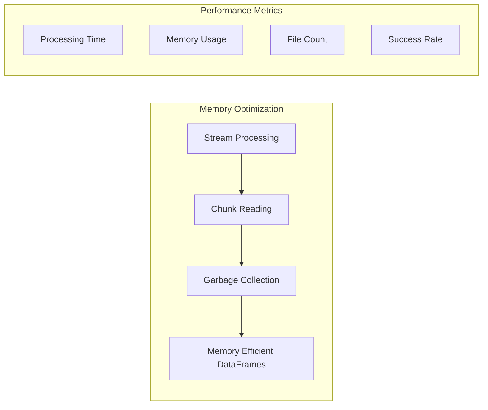

#### Large File Handling
```python
def process_large_zip(uploaded_file, chunk_size=1000):
    """Process large ZIP files in chunks"""
    links = {'ko': [], 'ja': []}
    processed_count = 0

    with zipfile.ZipFile(io.BytesIO(uploaded_file.getvalue())) as zf:
        file_list = zf.namelist()

        # Process in chunks
        for i in range(0, len(file_list), chunk_size):
            chunk = file_list[i:i + chunk_size]

            for full_path in chunk:
                # Process file...
                processed_count += 1

                # Update progress
                if processed_count % 100 == 0:
                    st.progress(processed_count / len(file_list))

    return links['ko'], links['ja']
```

---

## Troubleshooting Guide

### Common Issues & Solutions

#### 1. No Links Generated
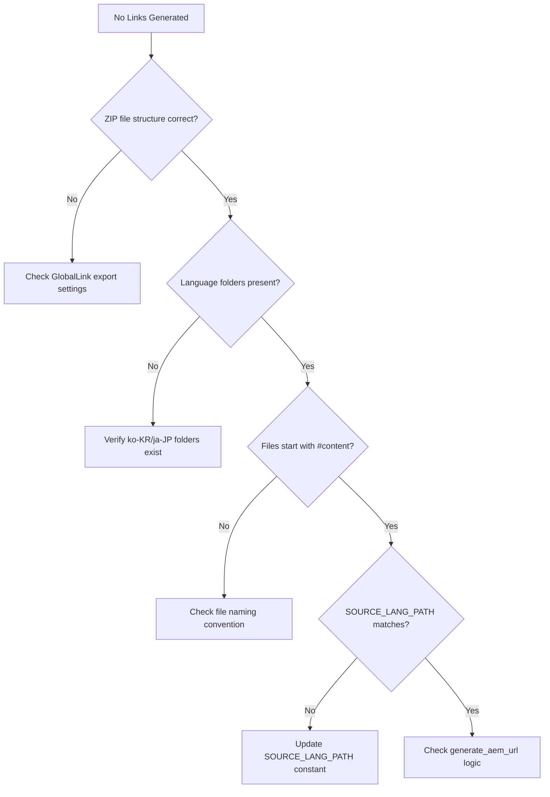

#### 2. Incorrect URLs Generated
```python
# Debug URL generation
def debug_generate_aem_url(file_name: str, target_lang: str):
    print(f"Input: {file_name}")

    target_lang_path = f"language-master#{target_lang}"
    print(f"Target lang path: {target_lang_path}")

    if SOURCE_LANG_PATH not in file_name:
        print(f"ERROR: {SOURCE_LANG_PATH} not found in {file_name}")
        return None

    target_file_name = file_name.replace(SOURCE_LANG_PATH, target_lang_path)
    print(f"After language replacement: {target_file_name}")

    if not target_file_name.startswith('#'):
        print(f"ERROR: File doesn't start with #: {target_file_name}")
        return None

    aem_path = target_file_name[1:].replace('#', '/')
    print(f"AEM path: {aem_path}")

    if aem_path.endswith('.xml'):
        aem_path = aem_path[:-4] + '.html'
        print(f"Final AEM path: {aem_path}")
    else:
        print(f"ERROR: File doesn't end with .xml: {aem_path}")
        return None

    final_url = f"{AEM_HOST}/editor.html/{aem_path}"
    print(f"Final URL: {final_url}")

    return final_url, aem_path
```

#### 3. HTML Template Issues
```python
# Template validation
def validate_template():
    try:
        with open(TEMPLATE_FILE, 'r', encoding='utf-8') as f:
            template = f.read()

        # Check required variables
        required_vars = ['{title}', '{source_info}', '{headers}', '{table_rows}']
        missing_vars = [var for var in required_vars if var not in template]

        if missing_vars:
            print(f"Missing template variables: {missing_vars}")
            return False

        print("Template validation passed")
        return True

    except FileNotFoundError:
        print(f"Template file not found: {TEMPLATE_FILE}")
        print("Using default template")
        return False
```

#### 4. Performance Issues
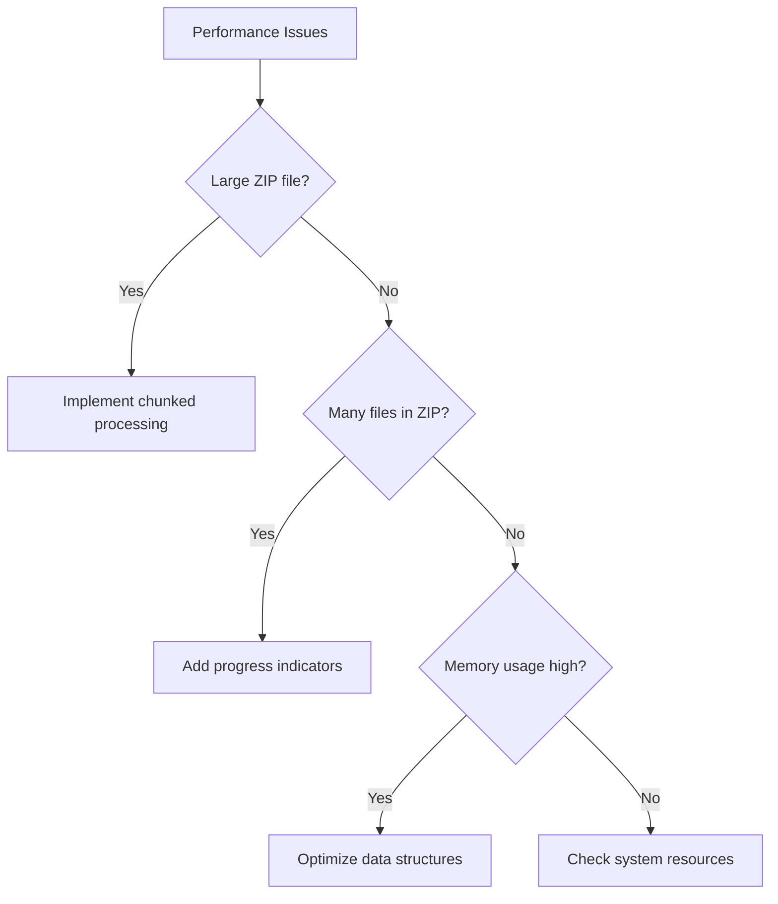

### Debugging Workflow
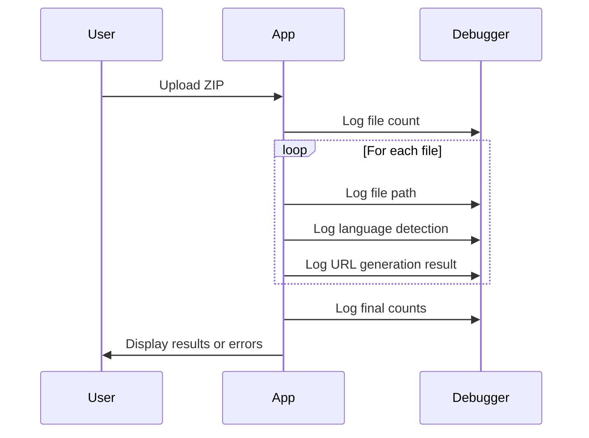

---

## Best Practices & Production Tips

### 1. Error Handling Strategy
```python
def robust_process_zip_file(uploaded_file):
    """Production-ready ZIP processing with error handling"""
    try:
        links = {'ko': [], 'ja': []}
        error_count = 0

        with zipfile.ZipFile(io.BytesIO(uploaded_file.getvalue())) as zf:
            for full_path in zf.namelist():
                try:
                    # Process individual file
                    result = process_single_file(full_path)
                    if result:
                        target_lang, url_data = result
                        links[target_lang].append(url_data)

                except Exception as e:
                    error_count += 1
                    st.warning(f"Error processing {full_path}: {str(e)}")
                    continue

        # Report summary
        total_files = len(zf.namelist())
        success_count = sum(len(links[lang]) for lang in links)

        st.info(f"Processed {total_files} files: {success_count} successful, {error_count} errors")

        return links['ko'], links['ja']

    except zipfile.BadZipFile:
        st.error("Invalid ZIP file. Please check the file format.")
        return [], []
    except Exception as e:
        st.error(f"Unexpected error: {str(e)}")
        return [], []
```

### 2. Security Considerations
```python
def secure_file_processing():
    """Security best practices"""

    # 1. File size limits
    MAX_FILE_SIZE = 100 * 1024 * 1024  # 100MB

    # 2. File type validation
    ALLOWED_EXTENSIONS = ['.zip']

    # 3. Path traversal protection
    def safe_extract_path(path):
        # Normalize path and check for directory traversal
        normalized = os.path.normpath(path)
        if normalized.startswith('../') or '\\' in normalized:
            raise ValueError(f"Unsafe path: {path}")
        return normalized

    # 4. Resource limits
    MAX_FILES_IN_ZIP = 10000
    MAX_PROCESSING_TIME = 300  # 5 minutes
```

### 3. Performance Optimization
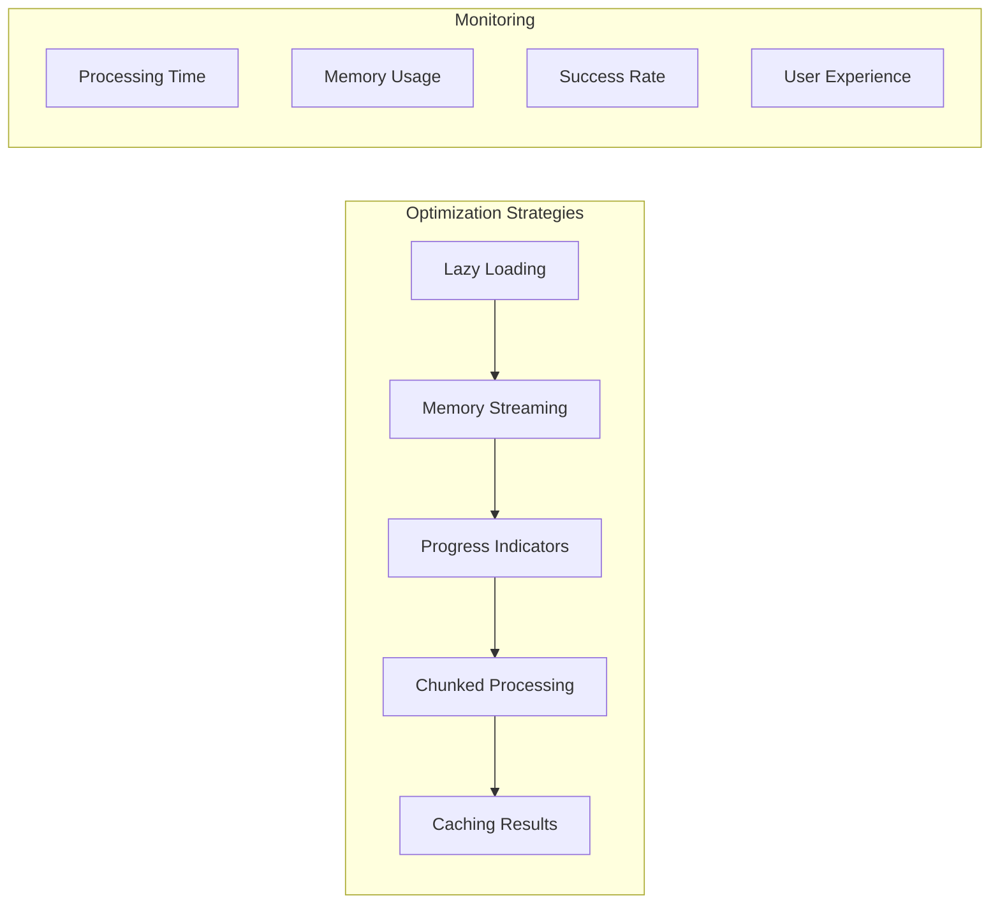

### 4. Production Deployment Checklist
```markdown
□ Environment variables configured
□ Error logging implemented
□ Performance monitoring added
□ Security measures in place
□ File size limits set
□ User feedback mechanisms
□ Backup and recovery plan
□ Documentation updated
□ Testing completed
□ Monitoring dashboards ready
```

### 5. Monitoring & Logging
```python
import logging
from datetime import datetime

# Configure logging
logging.basicConfig(
    level=logging.INFO,
    format='%(asctime)s - %(levelname)s - %(message)s',
    handlers=[
        logging.FileHandler('aem_converter.log'),
        logging.StreamHandler()
    ]
)

def log_processing_metrics(zip_name, total_files, ko_count, ja_count, processing_time):
    """Log key metrics for monitoring"""
    metrics = {
        'timestamp': datetime.now().isoformat(),
        'zip_file': zip_name,
        'total_files': total_files,
        'korean_links': ko_count,
        'japanese_links': ja_count,
        'processing_time_seconds': processing_time,
        'success_rate': (ko_count + ja_count) / total_files if total_files > 0 else 0
    }

    logging.info(f"Processing completed: {metrics}")
    return metrics
```

### 6. User Experience Enhancements
```python
# Enhanced UI with better feedback
def enhanced_streamlit_ui():
    st.set_page_config(
        page_title="AEM URL Converter",
        page_icon="🚀",
        layout="wide",
        initial_sidebar_state="expanded"
    )

    # Sidebar for settings
    with st.sidebar:
        st.header("⚙️ Settings")

        # Environment selection
        env = st.selectbox("Environment", ["Production", "Staging", "Development"])

        # Custom AEM host
        custom_host = st.text_input("Custom AEM Host (optional)")

        # Processing options
        show_progress = st.checkbox("Show detailed progress", value=True)
        include_metadata = st.checkbox("Include metadata in reports", value=True)

    # Main interface with better organization
    st.title("🚀 TPT GlobalLink AEM URL Converter")

    # Info section
    with st.expander("ℹ️ How to use this tool"):
        st.markdown("""
        1. **Upload**: Select your GlobalLink translation ZIP file
        2. **Process**: The tool will automatically detect Korean and Japanese files
        3. **Review**: View the generated AEM editor URLs in the table below
        4. **Download**: Export HTML reports for easy sharing with your team
        """)

    return env, custom_host, show_progress, include_metadata
```

---

## Conclusion

This tutorial has covered the complete journey from understanding the business problem to implementing a production-ready solution. The AEM URL Converter demonstrates how a simple monolithic application can solve complex enterprise workflow challenges effectively.

### Key Takeaways
1. **Simplicity wins**: Monolithic design provides clarity and reliability
2. **User-centric design**: Focus on solving real business problems
3. **Error handling**: Robust error handling is crucial for production use
4. **Performance matters**: Consider memory usage and processing time
5. **Documentation is key**: Clear documentation enables team adoption

### Next Steps
- Experiment with the code examples
- Try customizing the HTML templates
- Implement additional language support
- Add your own monitoring and logging
- Consider scaling strategies for your organization

Remember: The best code is code that solves real problems for real users. This application exemplifies that principle by transforming a manual, error-prone process into an automated, reliable workflow.