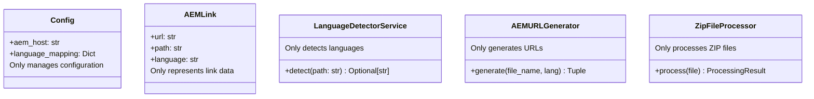
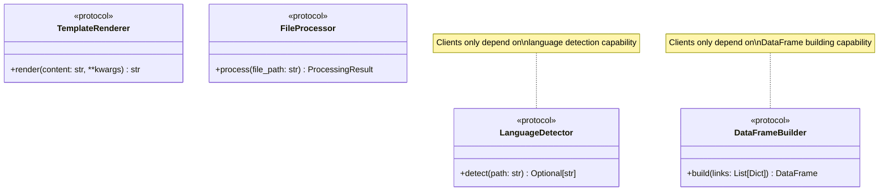

# AEM URL Converter SOLID Architecture: Zero to Hero Tutorial

## Table of Contents
1. [Introduction to SOLID Principles](#introduction-to-solid-principles)
2. [Architecture Overview](#architecture-overview)
3. [SOLID Principles Deep Dive](#solid-principles-deep-dive)
4. [Layer-by-Layer Analysis](#layer-by-layer-analysis)
5. [Dependency Injection Mastery](#dependency-injection-mastery)
6. [Advanced Design Patterns](#advanced-design-patterns)
7. [Real-World Implementation Examples](#real-world-implementation-examples)
8. [Testing Strategy](#testing-strategy)
9. [Performance & Scalability](#performance--scalability)
10. [Best Practices & Anti-Patterns](#best-practices--anti-patterns)

---

## Introduction to SOLID Principles

### What Makes This Architecture Special?

The AEM URL Converter showcases how SOLID principles transform a simple monolithic application into a maintainable, extensible, and testable enterprise-grade solution.

### SOLID Principles Quick Reference


### Why Refactor from Monolithic?

#### Before: Monolithic Challenges


#### After: SOLID Benefits


---

## Architecture Overview

### Clean Architecture Layers


### Directory Structure Analysis
```
gl_to_aem_url_converter/
├── core/                    # 🎯 Domain Layer (Business Logic)
│   ├── config.py           # Configuration management
│   ├── models.py           # Business entities
│   └── interfaces.py       # Abstract contracts
├── services/               # ⚙️ Service Layer (Application Logic)
│   ├── language.py         # Language detection
│   ├── url_generator.py    # URL generation
│   └── file_processor.py   # File processing
├── presentation/           # 🎨 Presentation Layer (UI Logic)
│   ├── df_builder.py       # DataFrame construction
│   ├── html_renderer.py    # HTML generation
│   └── template_loader.py  # Template management
├── di_container.py         # 🔧 Dependency Injection
├── app.py                  # 🌐 Streamlit Application
└── main.py                 # 🚀 Entry Point
```

---

## SOLID Principles Deep Dive

### 1. Single Responsibility Principle (SRP)

#### ❌ Monolithic Violation
```python
# OLD: One class doing everything
class AEMConverter:
    def load_template(self):      # Template responsibility
    def detect_language(self):    # Language responsibility
    def generate_url(self):       # URL responsibility
    def process_zip(self):        # File processing responsibility
    def build_dataframe(self):    # Data responsibility
    def render_html(self):        # Rendering responsibility
```

#### ✅ SOLID Compliance


#### SRP Implementation Example
```python
# Each class has ONE reason to change
class LanguageDetectorService:
    """Responsible ONLY for language detection"""
    def __init__(self, config: Config):
        self.config = config

    def detect(self, file_path: str) -> Optional[str]:
        """Single responsibility: detect language from path"""
        for pattern, lang_code in self.config.language_mapping.items():
            if pattern in file_path:
                return lang_code
        return None

class AEMURLGenerator:
    """Responsible ONLY for URL generation"""
    def __init__(self, config: Config):
        self.config = config

    def generate(self, file_name: str, target_lang: str) -> Optional[Tuple[str, str]]:
        """Single responsibility: generate AEM URLs"""
        # URL generation logic only
        pass
```

### 2. Open/Closed Principle (OCP)

#### Extension Without Modification


#### Adding New URL Generators
```python
# Base abstraction - NEVER changes
class URLGenerator(ABC):
    @abstractmethod
    def generate(self, file_name: str, target_lang: str) -> Optional[Tuple[str, str]]:
        pass

# Current implementation
class AEMURLGenerator(URLGenerator):
    def generate(self, file_name: str, target_lang: str) -> Optional[Tuple[str, str]]:
        # AEM-specific logic
        pass

# NEW: Add SharePoint support WITHOUT modifying existing code
class SharePointURLGenerator(URLGenerator):
    def generate(self, file_name: str, target_lang: str) -> Optional[Tuple[str, str]]:
        # SharePoint-specific logic
        base_url = "https://sharepoint.company.com"
        # ... implementation
        return f"{base_url}/sites/{target_lang}/{file_name}", file_name

# NEW: Add Confluence support WITHOUT modifying existing code
class ConfluenceURLGenerator(URLGenerator):
    def generate(self, file_name: str, target_lang: str) -> Optional[Tuple[str, str]]:
        # Confluence-specific logic
        base_url = "https://confluence.company.com"
        # ... implementation
        return f"{base_url}/wiki/spaces/{target_lang}/{file_name}", file_name

# Configuration change only - no code modification
class DIContainer:
    @property
    def url_generator(self) -> URLGenerator:
        generator_type = self.config.url_generator_type
        if generator_type == "aem":
            return AEMURLGenerator(self.config)
        elif generator_type == "sharepoint":
            return SharePointURLGenerator(self.config)
        elif generator_type == "confluence":
            return ConfluenceURLGenerator(self.config)
```

### 3. Liskov Substitution Principle (LSP)

#### Interchangeable Implementations


#### LSP Compliance Example
```python
def test_url_generator_substitution():
    """All URLGenerator implementations must be interchangeable"""

    # Test data
    file_name = "#content#language-master#en#products#test.xml"
    target_lang = "ko"

    # All implementations must behave consistently
    generators = [
        AEMURLGenerator(config),
        SharePointURLGenerator(config),
        ConfluenceURLGenerator(config)
    ]

    for generator in generators:
        result = generator.generate(file_name, target_lang)

        # LSP: All implementations must return same type
        assert isinstance(result, tuple) or result is None

        if result:
            url, path = result
            assert isinstance(url, str)
            assert isinstance(path, str)
            assert url.startswith("http")  # Common contract
```

### 4. Interface Segregation Principle (ISP)

#### Focused Interfaces


#### ISP Implementation
```python
# BAD: Fat interface that violates ISP
class FileManager:
    def detect_language(self, path: str): pass      # Language detection
    def generate_url(self, file_name: str): pass    # URL generation
    def build_dataframe(self, links: List): pass    # DataFrame building
    def render_html(self, content: str): pass       # HTML rendering

# GOOD: Segregated interfaces following ISP
class LanguageDetector(Protocol):
    """Only language detection capability"""
    def detect(self, path: str) -> Optional[str]: ...

class URLGenerator(Protocol):
    """Only URL generation capability"""
    def generate(self, file_name: str, target_lang: str) -> Optional[Tuple[str, str]]: ...

class DataFrameBuilder(Protocol):
    """Only DataFrame building capability"""
    def build(self, links: List[Dict[str, str]]) -> pd.DataFrame: ...

# Clients depend only on what they need
class ZipFileProcessor:
    def __init__(self,
                 language_detector: LanguageDetector,  # Only needs language detection
                 url_generator: URLGenerator):         # Only needs URL generation
        self.language_detector = language_detector
        self.url_generator = url_generator

    # This class doesn't need DataFrame building or HTML rendering
```

### 5. Dependency Inversion Principle (DIP)

#### Dependency Flow Diagram


#### DIP Implementation
```python
# HIGH-LEVEL MODULE depends on ABSTRACTION
class ZipFileProcessor:
    def __init__(self,
                 language_detector: LanguageDetector,  # Abstraction
                 url_generator: URLGenerator):         # Abstraction
        self.language_detector = language_detector
        self.url_generator = url_generator

# LOW-LEVEL MODULES implement ABSTRACTIONS
class LanguageDetectorService(LanguageDetector):
    def detect(self, path: str) -> Optional[str]:
        # Implementation details
        pass

class AEMURLGenerator(URLGenerator):
    def generate(self, file_name: str, target_lang: str) -> Optional[Tuple[str, str]]:
        # Implementation details
        pass

# DEPENDENCY INJECTION CONTAINER manages dependencies
class DIContainer:
    @property
    def language_detector(self) -> LanguageDetector:
        return LanguageDetectorService(self.config)

    @property
    def url_generator(self) -> URLGenerator:
        return AEMURLGenerator(self.config)

    @property
    def zip_processor(self) -> ZipFileProcessor:
        return ZipFileProcessor(
            self.language_detector,  # Injection
            self.url_generator       # Injection
        )
```

---

## Layer-by-Layer Analysis

### Core Domain Layer

#### Domain Models Design


#### Rich Domain Behavior Examples
```python
@dataclass(frozen=True)
class AEMLink:
    """Rich domain model with behavior"""
    url: str
    path: str
    language: str

    def get_path_parts(self) -> List[str]:
        """Business logic: Extract hierarchical path components"""
        return self.path.strip('/').split('/')[1:]  # Skip 'content'

    def get_page_name(self) -> str:
        """Business logic: Get the final page name"""
        parts = self.get_path_parts()
        return parts[-1] if parts else ""

    def get_language_master_url(self) -> str:
        """Business logic: Generate English master URL"""
        return self.url.replace(f'/language-master/{self.language}/', '/language-master/en/')

    def get_spac_url(self, config: Config) -> str:
        """Business logic: Generate SPAC URL"""
        spac_path = config.get_spac_path(self.language)
        return self.url.replace(f'/language-master/{self.language}/', spac_path)

@dataclass
class LinkCollection:
    """Aggregate root managing link collections"""
    korean: List[AEMLink] = field(default_factory=list)
    japanese: List[AEMLink] = field(default_factory=list)

    def add_link(self, link: AEMLink) -> None:
        """Business logic: Add link to appropriate collection"""
        if link.language == 'ko':
            self.korean.append(link)
        elif link.language == 'ja':
            self.japanese.append(link)
        else:
            raise ValueError(f"Unsupported language: {link.language}")

    def get_by_language(self, lang_code: str) -> List[AEMLink]:
        """Business logic: Retrieve links by language"""
        return getattr(self, self._get_language_attr(lang_code), [])

    def _get_language_attr(self, lang_code: str) -> str:
        """Private: Map language code to attribute name"""
        mapping = {'ko': 'korean', 'ja': 'japanese'}
        if lang_code not in mapping:
            raise ValueError(f"Unsupported language: {lang_code}")
        return mapping[lang_code]
```

### Service Layer Architecture

#### Service Interactions


#### Service Implementation Patterns
```python
class ZipFileProcessor:
    """Orchestrates the file processing workflow"""

    def __init__(self,
                 language_detector: LanguageDetector,
                 url_generator: URLGenerator):
        self.language_detector = language_detector
        self.url_generator = url_generator

    def process(self, uploaded_file) -> ProcessingResult:
        """Main processing workflow following business rules"""
        result = ProcessingResult()
        link_collection = LinkCollection()

        try:
            with zipfile.ZipFile(io.BytesIO(uploaded_file.getvalue())) as zf:
                for file_path in zf.namelist():
                    self._process_single_file(file_path, link_collection, result)

            result.links = link_collection
            result.processed_count = len(zf.namelist())

        except Exception as e:
            result.add_warning(f"Processing error: {str(e)}")

        return result

    def _process_single_file(self, file_path: str,
                           link_collection: LinkCollection,
                           result: ProcessingResult) -> None:
        """Process individual file following business rules"""

        # Business rule: Detect language
        language = self.language_detector.detect(file_path)
        if not language:
            return

        # Business rule: Filter content files
        file_name = os.path.basename(file_path)
        if not file_name.startswith("#content"):
            return

        # Business rule: Generate URL
        url_result = self.url_generator.generate(file_name, language)
        if not url_result:
            result.add_warning(f"Could not generate URL for {file_name}")
            return

        # Business rule: Create domain object
        url, path = url_result
        aem_link = AEMLink(url=url, path=path, language=language)
        link_collection.add_link(aem_link)
```

### Presentation Layer Design

#### Presentation Responsibilities


#### Advanced DataFrame Building
```python
class HierarchicalDataFrameBuilder:
    """Transforms business data into presentation format"""

    def build(self, links: List[Dict[str, str]]) -> pd.DataFrame:
        """Create hierarchical DataFrame with business logic"""
        if not links:
            return pd.DataFrame()

        # Business logic: Extract path hierarchy
        processed_data = []
        for link_data in links:
            aem_link = AEMLink(**link_data)
            path_parts = aem_link.get_path_parts()
            processed_data.append(self._create_row_data(aem_link, path_parts))

        # Presentation logic: Build DataFrame structure
        max_depth = max(len(data['path_parts']) for data in processed_data)
        return self._build_dataframe(processed_data, max_depth)

    def _create_row_data(self, aem_link: AEMLink, path_parts: List[str]) -> Dict:
        """Transform domain object to presentation data"""
        return {
            'aem_link': aem_link,
            'path_parts': path_parts,
            'page_name': aem_link.get_page_name(),
            'url': aem_link.url
        }

    def _build_dataframe(self, data: List[Dict], max_depth: int) -> pd.DataFrame:
        """Create hierarchical table structure"""
        table_data = []

        for item in data:
            row = {}
            path_parts = item['path_parts']

            # Build hierarchical columns
            for level in range(max_depth):
                col_name = f"Level {level + 2}"  # Start from Level 2

                if level < len(path_parts) - 1:
                    # Intermediate levels: show path component
                    row[col_name] = path_parts[level]
                elif level == len(path_parts) - 1:
                    # Final level: show as clickable link
                    page_name = item['page_name']
                    url = item['url']
                    row[col_name] = f"[{page_name}]({url})"
                else:
                    # Empty cells for shorter paths
                    row[col_name] = ""

            table_data.append(row)

        return pd.DataFrame(table_data)
```

---

## Dependency Injection Mastery

### DI Container Architecture


### Lazy Loading Implementation
```python
class DIContainer:
    """Dependency injection container with lazy loading"""

    def __init__(self, config: Config):
        self.config = config
        # Initialize all services as None (lazy loading)
        self._language_detector: Optional[LanguageDetectorService] = None
        self._url_generator: Optional[AEMURLGenerator] = None
        self._zip_processor: Optional[ZipFileProcessor] = None
        self._df_builder: Optional[HierarchicalDataFrameBuilder] = None
        self._html_renderer: Optional[HTMLTableRenderer] = None
        self._template_loader: Optional[TemplateLoader] = None

    @property
    def language_detector(self) -> LanguageDetectorService:
        """Lazy-loaded language detector service"""
        if self._language_detector is None:
            self._language_detector = LanguageDetectorService(self.config)
        return self._language_detector

    @property
    def url_generator(self) -> AEMURLGenerator:
        """Lazy-loaded URL generator service"""
        if self._url_generator is None:
            self._url_generator = AEMURLGenerator(self.config)
        return self._url_generator

    @property
    def zip_processor(self) -> ZipFileProcessor:
        """Lazy-loaded ZIP processor with dependencies"""
        if self._zip_processor is None:
            self._zip_processor = ZipFileProcessor(
                language_detector=self.language_detector,  # Dependency injection
                url_generator=self.url_generator            # Dependency injection
            )
        return self._zip_processor

    @property
    def html_renderer(self) -> HTMLTableRenderer:
        """Lazy-loaded HTML renderer with complex dependencies"""
        if self._html_renderer is None:
            # Complex dependency graph resolution
            quick_links_gen = QuickLinksGenerator(self.config)
            template_loader = self.template_loader

            self._html_renderer = HTMLTableRenderer(
                quick_links_generator=quick_links_gen,
                template_loader=template_loader
            )
        return self._html_renderer
```

### Advanced DI Patterns

#### Factory Pattern Integration
```python
class DIContainer:
    def create_url_generator(self, generator_type: str) -> URLGenerator:
        """Factory method for URL generators"""
        factory_map = {
            'aem': lambda: AEMURLGenerator(self.config),
            'sharepoint': lambda: SharePointURLGenerator(self.config),
            'confluence': lambda: ConfluenceURLGenerator(self.config)
        }

        if generator_type not in factory_map:
            raise ValueError(f"Unknown generator type: {generator_type}")

        return factory_map[generator_type]()

    def create_specialized_processor(self, processor_config: Dict[str, Any]) -> FileProcessor:
        """Factory method for specialized processors"""
        processor_type = processor_config.get('type', 'default')

        if processor_type == 'batch':
            return BatchFileProcessor(
                language_detector=self.language_detector,
                url_generator=self.url_generator,
                batch_size=processor_config.get('batch_size', 100)
            )
        elif processor_type == 'stream':
            return StreamFileProcessor(
                language_detector=self.language_detector,
                url_generator=self.url_generator
            )
        else:
            return self.zip_processor
```

#### Service Lifecycle Management
```python
class DIContainer:
    def reset(self) -> None:
        """Reset all services (useful for testing or reconfiguration)"""
        self._language_detector = None
        self._url_generator = None
        self._zip_processor = None
        self._df_builder = None
        self._html_renderer = None
        self._template_loader = None

    def warm_up(self) -> None:
        """Pre-initialize critical services for performance"""
        critical_services = [
            'language_detector',
            'url_generator',
            'zip_processor'
        ]

        for service_name in critical_services:
            getattr(self, service_name)  # Trigger lazy loading

    def get_service_status(self) -> Dict[str, bool]:
        """Check which services are currently loaded"""
        return {
            'language_detector': self._language_detector is not None,
            'url_generator': self._url_generator is not None,
            'zip_processor': self._zip_processor is not None,
            'df_builder': self._df_builder is not None,
            'html_renderer': self._html_renderer is not None,
            'template_loader': self._template_loader is not None
        }
```

---

## Advanced Design Patterns

### Repository Pattern for Configuration


### Strategy Pattern for URL Generation
```python
class URLGenerationStrategy(ABC):
    """Strategy interface for different URL generation approaches"""

    @abstractmethod
    def generate_url(self, file_name: str, target_lang: str, config: Config) -> Optional[str]:
        pass

class AEMStrategy(URLGenerationStrategy):
    """AEM-specific URL generation strategy"""

    def generate_url(self, file_name: str, target_lang: str, config: Config) -> Optional[str]:
        # AEM-specific logic
        return f"{config.aem_host}/editor.html/{self._transform_path(file_name, target_lang)}"

class SharePointStrategy(URLGenerationStrategy):
    """SharePoint-specific URL generation strategy"""

    def generate_url(self, file_name: str, target_lang: str, config: Config) -> Optional[str]:
        # SharePoint-specific logic
        return f"{config.sharepoint_host}/sites/{target_lang}/{self._transform_path(file_name)}"

class URLGeneratorContext:
    """Context that uses strategy pattern"""

    def __init__(self, strategy: URLGenerationStrategy):
        self.strategy = strategy

    def set_strategy(self, strategy: URLGenerationStrategy):
        self.strategy = strategy

    def generate(self, file_name: str, target_lang: str, config: Config) -> Optional[str]:
        return self.strategy.generate_url(file_name, target_lang, config)
```

### Command Pattern for Processing Operations


```python
class Command(ABC):
    """Command interface"""

    @abstractmethod
    def execute(self) -> Any:
        pass

    @abstractmethod
    def undo(self) -> Any:
        pass

class ProcessZipCommand(Command):
    """Command to process ZIP file"""

    def __init__(self, processor: ZipFileProcessor, uploaded_file: Any):
        self.processor = processor
        self.uploaded_file = uploaded_file
        self.result: Optional[ProcessingResult] = None

    def execute(self) -> ProcessingResult:
        self.result = self.processor.process(self.uploaded_file)
        return self.result

    def undo(self) -> None:
        # Implement undo logic if needed
        self.result = None

class CommandInvoker:
    """Invoker that manages commands"""

    def __init__(self):
        self.commands: List[Command] = []
        self.current_index = -1

    def execute_command(self, command: Command) -> Any:
        # Remove any commands after current index (for redo functionality)
        self.commands = self.commands[:self.current_index + 1]

        # Execute new command
        result = command.execute()
        self.commands.append(command)
        self.current_index += 1

        return result

    def undo_last_command(self) -> bool:
        if self.current_index >= 0:
            command = self.commands[self.current_index]
            command.undo()
            self.current_index -= 1
            return True
        return False
```

### Observer Pattern for Processing Events
```python
class ProcessingEvent:
    """Event data class"""
    def __init__(self, event_type: str, data: Dict[str, Any]):
        self.event_type = event_type
        self.data = data
        self.timestamp = datetime.now()

class ProcessingObserver(ABC):
    """Observer interface"""

    @abstractmethod
    def on_processing_event(self, event: ProcessingEvent) -> None:
        pass

class LoggingObserver(ProcessingObserver):
    """Observer that logs events"""

    def on_processing_event(self, event: ProcessingEvent) -> None:
        logger.info(f"Processing event: {event.event_type} at {event.timestamp}")
        logger.debug(f"Event data: {event.data}")

class MetricsObserver(ProcessingObserver):
    """Observer that collects metrics"""

    def __init__(self):
        self.metrics = {}

    def on_processing_event(self, event: ProcessingEvent) -> None:
        event_type = event.event_type
        self.metrics[event_type] = self.metrics.get(event_type, 0) + 1

class ObservableZipFileProcessor(ZipFileProcessor):
    """ZIP processor with observer pattern"""

    def __init__(self, language_detector: LanguageDetector, url_generator: URLGenerator):
        super().__init__(language_detector, url_generator)
        self.observers: List[ProcessingObserver] = []

    def add_observer(self, observer: ProcessingObserver) -> None:
        self.observers.append(observer)

    def remove_observer(self, observer: ProcessingObserver) -> None:
        self.observers.remove(observer)

    def notify_observers(self, event: ProcessingEvent) -> None:
        for observer in self.observers:
            observer.on_processing_event(event)

    def process(self, uploaded_file) -> ProcessingResult:
        # Notify start of processing
        self.notify_observers(ProcessingEvent("processing_started", {"file_size": len(uploaded_file.getvalue())}))

        result = super().process(uploaded_file)

        # Notify completion
        self.notify_observers(ProcessingEvent("processing_completed", {
            "success": result.is_successful(),
            "link_count": result.links.get_total_count()
        }))

        return result
```

---

## Real-World Implementation Examples

### Complete Processing Flow


### Error Handling Strategy
```python
class ProcessingError(Exception):
    """Base exception for processing errors"""
    pass

class LanguageDetectionError(ProcessingError):
    """Raised when language detection fails"""
    pass

class URLGenerationError(ProcessingError):
    """Raised when URL generation fails"""
    pass

class FileProcessingError(ProcessingError):
    """Raised when file processing fails"""
    pass

class RobustZipFileProcessor(ZipFileProcessor):
    """ZIP processor with comprehensive error handling"""

    def process(self, uploaded_file) -> ProcessingResult:
        result = ProcessingResult()
        link_collection = LinkCollection()

        try:
            with zipfile.ZipFile(io.BytesIO(uploaded_file.getvalue())) as zf:
                file_count = len(zf.namelist())

                for i, file_path in enumerate(zf.namelist()):
                    try:
                        self._process_file_with_recovery(file_path, link_collection, result)
                    except ProcessingError as e:
                        result.add_warning(f"Error processing {file_path}: {str(e)}")
                        result.error_count += 1
                    except Exception as e:
                        result.add_warning(f"Unexpected error processing {file_path}: {str(e)}")
                        result.error_count += 1

                    # Progress tracking
                    if i % 10 == 0:  # Update every 10 files
                        progress = (i / file_count) * 100
                        result.add_warning(f"Processing progress: {progress:.1f}%")

        except zipfile.BadZipFile:
            result.add_warning("Invalid ZIP file format")
            return result
        except Exception as e:
            result.add_warning(f"Fatal error: {str(e)}")
            return result

        result.links = link_collection
        result.processed_count = file_count - result.error_count

        return result

    def _process_file_with_recovery(self, file_path: str,
                                  link_collection: LinkCollection,
                                  result: ProcessingResult) -> None:
        """Process file with error recovery"""

        # Language detection with fallback
        try:
            language = self.language_detector.detect(file_path)
        except Exception as e:
            raise LanguageDetectionError(f"Language detection failed: {str(e)}")

        if not language:
            return  # Skip files without language

        # File filtering
        file_name = os.path.basename(file_path)
        if not file_name.startswith("#content"):
            return

        # URL generation with retry logic
        max_retries = 3
        for attempt in range(max_retries):
            try:
                url_result = self.url_generator.generate(file_name, language)
                break
            except Exception as e:
                if attempt == max_retries - 1:
                    raise URLGenerationError(f"URL generation failed after {max_retries} attempts: {str(e)}")
                time.sleep(0.1)  # Brief delay before retry

        if not url_result:
            raise URLGenerationError("URL generation returned None")

        # Link creation
        try:
            url, path = url_result
            aem_link = AEMLink(url=url, path=path, language=language)
            link_collection.add_link(aem_link)
        except Exception as e:
            raise FileProcessingError(f"Link creation failed: {str(e)}")
```

### Performance Optimization
```python
class OptimizedZipFileProcessor(ZipFileProcessor):
    """High-performance ZIP processor with optimization techniques"""

    def __init__(self, language_detector: LanguageDetector, url_generator: URLGenerator):
        super().__init__(language_detector, url_generator)
        self.file_cache: Dict[str, Optional[str]] = {}  # Language detection cache
        self.url_cache: Dict[tuple, Optional[tuple]] = {}  # URL generation cache

    def process(self, uploaded_file) -> ProcessingResult:
        """Optimized processing with caching and parallel processing"""

        # Pre-analysis for optimization
        file_paths = self._analyze_zip_structure(uploaded_file)

        # Batch processing for better performance
        batch_size = 50
        batches = [file_paths[i:i + batch_size] for i in range(0, len(file_paths), batch_size)]

        result = ProcessingResult()
        link_collection = LinkCollection()

        for batch in batches:
            batch_results = self._process_batch(batch, uploaded_file)
            for batch_result in batch_results:
                if batch_result:
                    link_collection.add_link(batch_result)

        result.links = link_collection
        result.processed_count = len(file_paths)

        return result

    def _analyze_zip_structure(self, uploaded_file) -> List[str]:
        """Pre-analyze ZIP to optimize processing order"""
        with zipfile.ZipFile(io.BytesIO(uploaded_file.getvalue())) as zf:
            file_paths = zf.namelist()

        # Sort files for better cache locality
        # Process files from same language together
        def sort_key(path):
            if 'ko-KR' in path:
                return (0, path)
            elif 'ja-JP' in path:
                return (1, path)
            else:
                return (2, path)

        return sorted(file_paths, key=sort_key)

    def _process_batch(self, file_paths: List[str], uploaded_file) -> List[Optional[AEMLink]]:
        """Process a batch of files with optimization"""
        results = []

        for file_path in file_paths:
            # Use cached language detection
            language = self._get_cached_language(file_path)
            if not language:
                continue

            file_name = os.path.basename(file_path)
            if not file_name.startswith("#content"):
                continue

            # Use cached URL generation
            url_result = self._get_cached_url(file_name, language)
            if not url_result:
                continue

            url, path = url_result
            aem_link = AEMLink(url=url, path=path, language=language)
            results.append(aem_link)

        return results

    def _get_cached_language(self, file_path: str) -> Optional[str]:
        """Get language with caching"""
        if file_path not in self.file_cache:
            self.file_cache[file_path] = self.language_detector.detect(file_path)
        return self.file_cache[file_path]

    def _get_cached_url(self, file_name: str, language: str) -> Optional[tuple]:
        """Get URL with caching"""
        cache_key = (file_name, language)
        if cache_key not in self.url_cache:
            self.url_cache[cache_key] = self.url_generator.generate(file_name, language)
        return self.url_cache[cache_key]
```

---

## Testing Strategy

### Testing Architecture


### Unit Testing with Dependency Injection
```python
import pytest
from unittest.mock import Mock, MagicMock
from core.models import AEMLink, LinkCollection, ProcessingResult
from services.file_processor import ZipFileProcessor
from di_container import TestDIContainer

class TestZipFileProcessor:
    """Comprehensive unit tests for ZipFileProcessor"""

    def setup_method(self):
        """Setup test dependencies"""
        self.mock_language_detector = Mock()
        self.mock_url_generator = Mock()
        self.processor = ZipFileProcessor(
            language_detector=self.mock_language_detector,
            url_generator=self.mock_url_generator
        )

    def test_process_successful_file(self):
        """Test successful file processing"""
        # Arrange
        mock_file = self._create_mock_zip_file([
            "ko-KR/#content#language-master#en#products#test.xml"
        ])

        self.mock_language_detector.detect.return_value = "ko"
        self.mock_url_generator.generate.return_value = (
            "https://example.com/editor.html/content/language-master/ko/products/test.html",
            "content/language-master/ko/products/test.html"
        )

        # Act
        result = self.processor.process(mock_file)

        # Assert
        assert result.is_successful()
        assert result.links.get_total_count() == 1
        korean_links = result.links.get_by_language("ko")
        assert len(korean_links) == 1
        assert korean_links[0].language == "ko"

        # Verify service interactions
        self.mock_language_detector.detect.assert_called_once()
        self.mock_url_generator.generate.assert_called_once_with(
            "#content#language-master#en#products#test.xml", "ko"
        )

    def test_process_language_detection_failure(self):
        """Test handling of language detection failure"""
        # Arrange
        mock_file = self._create_mock_zip_file([
            "unknown-lang/#content#language-master#en#products#test.xml"
        ])

        self.mock_language_detector.detect.return_value = None

        # Act
        result = self.processor.process(mock_file)

        # Assert
        assert result.is_successful()  # Should still succeed
        assert result.links.get_total_count() == 0
        self.mock_url_generator.generate.assert_not_called()

    def test_process_url_generation_failure(self):
        """Test handling of URL generation failure"""
        # Arrange
        mock_file = self._create_mock_zip_file([
            "ko-KR/#content#language-master#en#products#test.xml"
        ])

        self.mock_language_detector.detect.return_value = "ko"
        self.mock_url_generator.generate.return_value = None

        # Act
        result = self.processor.process(mock_file)

        # Assert
        assert result.is_successful()
        assert result.links.get_total_count() == 0
        assert len(result.warnings) > 0

    def _create_mock_zip_file(self, file_paths: List[str]):
        """Helper to create mock ZIP file"""
        mock_file = MagicMock()
        mock_file.getvalue.return_value = b"mock zip content"

        with patch('zipfile.ZipFile') as mock_zip:
            mock_zip.return_value.__enter__.return_value.namelist.return_value = file_paths
            return mock_file

class TestDomainModels:
    """Test domain models behavior"""

    def test_aem_link_path_parts(self):
        """Test AEMLink path manipulation"""
        # Arrange
        link = AEMLink(
            url="https://example.com/editor.html/content/language-master/ko/products/systems/nextseq.html",
            path="content/language-master/ko/products/systems/nextseq.html",
            language="ko"
        )

        # Act & Assert
        path_parts = link.get_path_parts()
        expected_parts = ["language-master", "ko", "products", "systems", "nextseq.html"]
        assert path_parts == expected_parts

        page_name = link.get_page_name()
        assert page_name == "nextseq.html"

    def test_link_collection_language_management(self):
        """Test LinkCollection language-specific operations"""
        # Arrange
        collection = LinkCollection()
        korean_link = AEMLink("https://example.com/ko", "path/ko", "ko")
        japanese_link = AEMLink("https://example.com/ja", "path/ja", "ja")

        # Act
        collection.add_link(korean_link)
        collection.add_link(japanese_link)

        # Assert
        assert collection.get_total_count() == 2
        assert len(collection.get_by_language("ko")) == 1
        assert len(collection.get_by_language("ja")) == 1
        assert collection.has_links()

    def test_processing_result_success_criteria(self):
        """Test ProcessingResult success evaluation"""
        # Arrange
        result = ProcessingResult()
        link_collection = LinkCollection()
        link_collection.add_link(AEMLink("url", "path", "ko"))

        # Act
        result.links = link_collection
        result.processed_count = 10
        result.error_count = 2

        # Assert
        assert result.is_successful()  # Has links and not all files failed

        # Test failure case
        result.error_count = 10  # All files failed
        assert not result.is_successful()
```

### Integration Testing with TestDIContainer
```python
class TestIntegrationWithDI:
    """Integration tests using dependency injection"""

    def setup_method(self):
        """Setup test environment"""
        config = Config(
            aem_host="https://test.example.com",
            source_lang="en",
            template_file="test_template.html"
        )
        self.container = TestDIContainer(config)

    def test_end_to_end_processing(self):
        """Test complete processing flow"""
        # Arrange - Create realistic test data
        test_zip_content = self._create_test_zip_with_files([
            "ko-KR/#content#language-master#en#products#diagnostics#nextseq.xml",
            "ja-JP/#content#language-master#en#products#reagents#v3-kit.xml",
            "ko-KR/#content#language-master#en#support#downloads#software.xml"
        ])

        # Act - Process through the complete pipeline
        processor = self.container.zip_processor
        result = processor.process(test_zip_content)

        # Assert - Verify end-to-end results
        assert result.is_successful()
        assert result.links.get_total_count() == 3

        # Verify Korean links
        korean_links = result.links.get_by_language("ko")
        assert len(korean_links) == 2
        for link in korean_links:
            assert "language-master/ko" in link.path
            assert "test.example.com" in link.url

        # Verify Japanese links
        japanese_links = result.links.get_by_language("ja")
        assert len(japanese_links) == 1
        assert "language-master/ja" in japanese_links[0].path

    def test_dataframe_building_integration(self):
        """Test DataFrame building with real data"""
        # Arrange
        links = [
            {"url": "https://test.com/ko/products/test1.html", "path": "content/language-master/ko/products/test1.html", "language": "ko"},
            {"url": "https://test.com/ko/support/test2.html", "path": "content/language-master/ko/support/test2.html", "language": "ko"}
        ]

        # Act
        df_builder = self.container.df_builder
        dataframe = df_builder.build(links)

        # Assert
        assert not dataframe.empty
        assert "Level 2" in dataframe.columns
        assert "Level 3" in dataframe.columns
        assert len(dataframe) == 2

        # Verify hierarchical structure
        level_2_values = dataframe["Level 2"].unique()
        assert "products" in level_2_values
        assert "support" in level_2_values

    def test_html_rendering_integration(self):
        """Test HTML rendering with template integration"""
        # Arrange
        links = [
            {"url": "https://test.com/ko/products/test.html", "path": "content/language-master/ko/products/test.html", "language": "ko"}
        ]

        # Mock template for testing
        mock_template_content = """
        <html>
        <head><title>{title}</title></head>
        <body>
            <h1>{title}</h1>
            <div>{source_info}</div>
            <table>{table_rows}</table>
        </body>
        </html>
        """

        # Inject mock template
        mock_template_loader = Mock()
        mock_template_loader.load_template.return_value = mock_template_content
        self.container.inject_mock('template_loader', mock_template_loader)

        # Act
        html_renderer = self.container.html_renderer
        html_output = html_renderer.render(
            links=links,
            language_name="Korean",
            source_zip_name="test.zip",
            job_id="TEST-001",
            submission_name="Test Submission"
        )

        # Assert
        assert "<html>" in html_output
        assert "Korean" in html_output
        assert "test.com/ko/products/test.html" in html_output
        assert "lm-en" in html_output  # Quick links
        assert "lm-ko" in html_output
        assert "spac-ko" in html_output
```

### Performance Testing
```python
import time
import psutil
import pytest
from typing import Dict, Any

class TestPerformance:
    """Performance and scalability tests"""

    def test_large_zip_processing_performance(self):
        """Test processing large ZIP files within acceptable time limits"""
        # Arrange - Create large test dataset
        large_file_list = [
            f"ko-KR/#content#language-master#en#products#category{i}#product{j}.xml"
            for i in range(10) for j in range(50)  # 500 Korean files
        ] + [
            f"ja-JP/#content#language-master#en#products#category{i}#product{j}.xml"
            for i in range(10) for j in range(50)  # 500 Japanese files
        ]

        large_zip = self._create_test_zip_with_files(large_file_list)

        container = TestDIContainer(self._get_test_config())
        processor = container.zip_processor

        # Act - Measure processing time
        start_time = time.time()
        start_memory = psutil.Process().memory_info().rss

        result = processor.process(large_zip)

        end_time = time.time()
        end_memory = psutil.Process().memory_info().rss

        # Assert - Performance requirements
        processing_time = end_time - start_time
        memory_increase = end_memory - start_memory

        assert processing_time < 30.0  # Should complete within 30 seconds
        assert memory_increase < 100 * 1024 * 1024  # Less than 100MB memory increase
        assert result.is_successful()
        assert result.links.get_total_count() == 1000

    def test_concurrent_processing(self):
        """Test concurrent processing scenarios"""
        import threading
        import queue

        # Arrange
        containers = [TestDIContainer(self._get_test_config()) for _ in range(5)]
        test_files = [self._create_test_zip_with_files([
            f"ko-KR/#content#language-master#en#test{i}#file.xml"
        ]) for i in range(5)]

        results = queue.Queue()

        def process_file(container, test_file):
            processor = container.zip_processor
            result = processor.process(test_file)
            results.put(result)

        # Act - Process files concurrently
        threads = []
        start_time = time.time()

        for container, test_file in zip(containers, test_files):
            thread = threading.Thread(target=process_file, args=(container, test_file))
            thread.start()
            threads.append(thread)

        for thread in threads:
            thread.join()

        end_time = time.time()

        # Assert - All processed successfully
        assert results.qsize() == 5

        all_results = []
        while not results.empty():
            result = results.get()
            assert result.is_successful()
            all_results.append(result)

        # Concurrent processing should be faster than sequential
        assert end_time - start_time < 10.0  # Should complete within 10 seconds

    def test_memory_efficiency(self):
        """Test memory usage patterns"""
        # Test that services are properly garbage collected
        container = TestDIContainer(self._get_test_config())

        # Initial memory
        initial_memory = psutil.Process().memory_info().rss

        # Create and use services
        for _ in range(100):
            processor = container.zip_processor
            small_file = self._create_test_zip_with_files([
                "ko-KR/#content#language-master#en#test#file.xml"
            ])
            result = processor.process(small_file)

            # Reset container to test cleanup
            container.reset()

        # Force garbage collection
        import gc
        gc.collect()

        final_memory = psutil.Process().memory_info().rss
        memory_increase = final_memory - initial_memory

        # Should not have significant memory leaks
        assert memory_increase < 50 * 1024 * 1024  # Less than 50MB increase
```

---

## Performance & Scalability

### Performance Monitoring Architecture


### Advanced Caching Strategy
```python
from functools import lru_cache
from typing import Optional, Tuple
import threading
import time

class CachedLanguageDetectorService:
    """Language detector with intelligent caching"""

    def __init__(self, config: Config):
        self.config = config
        self._cache: Dict[str, Optional[str]] = {}
        self._cache_lock = threading.RLock()
        self._cache_stats = {"hits": 0, "misses": 0}

    def detect(self, file_path: str) -> Optional[str]:
        """Detect language with caching"""
        # Fast path: check cache first
        with self._cache_lock:
            if file_path in self._cache:
                self._cache_stats["hits"] += 1
                return self._cache[file_path]

        # Slow path: compute and cache
        self._cache_stats["misses"] += 1
        result = self._compute_language(file_path)

        with self._cache_lock:
            self._cache[file_path] = result

            # Prevent unbounded cache growth
            if len(self._cache) > 10000:
                self._evict_old_entries()

        return result

    def _compute_language(self, file_path: str) -> Optional[str]:
        """Core language detection logic"""
        for pattern, lang_code in self.config.language_mapping.items():
            if pattern in file_path:
                return lang_code
        return None

    def _evict_old_entries(self):
        """Simple LRU eviction strategy"""
        # Keep only the most recent 5000 entries
        items = list(self._cache.items())
        self._cache = dict(items[-5000:])

    def get_cache_stats(self) -> Dict[str, int]:
        """Get cache performance statistics"""
        with self._cache_lock:
            total_requests = self._cache_stats["hits"] + self._cache_stats["misses"]
            hit_rate = self._cache_stats["hits"] / total_requests if total_requests > 0 else 0

            return {
                **self._cache_stats,
                "total_requests": total_requests,
                "hit_rate": hit_rate,
                "cache_size": len(self._cache)
            }

class PerformantURLGenerator:
    """URL generator with performance optimizations"""

    def __init__(self, config: Config):
        self.config = config
        self._url_patterns = self._precompile_patterns()
        self._generation_cache = {}

    def _precompile_patterns(self) -> Dict[str, str]:
        """Pre-compile URL patterns for faster generation"""
        patterns = {}
        for lang_code in self.config.get_supported_languages():
            patterns[lang_code] = f"language-master#{lang_code}"
        return patterns

    @lru_cache(maxsize=1000)
    def generate(self, file_name: str, target_lang: str) -> Optional[Tuple[str, str]]:
        """Generate URL with LRU caching"""
        try:
            return self._generate_url_optimized(file_name, target_lang)
        except Exception:
            return None

    def _generate_url_optimized(self, file_name: str, target_lang: str) -> Tuple[str, str]:
        """Optimized URL generation logic"""
        # Fast validation
        if not file_name.startswith('#'):
            raise ValueError("Invalid file format")

        # Use pre-compiled patterns
        target_pattern = self._url_patterns.get(target_lang)
        if not target_pattern:
            raise ValueError(f"Unsupported language: {target_lang}")

        # Efficient string operations
        target_file_name = file_name.replace(
            self.config.source_lang_path,
            target_pattern,
            1  # Replace only first occurrence
        )

        # Path transformation
        aem_path = target_file_name[1:].replace('#', '/')

        if not aem_path.endswith('.xml'):
            raise ValueError("Not an XML file")

        aem_path = aem_path[:-4] + '.html'
        final_url = f"{self.config.aem_host}/editor.html/{aem_path}"

        return final_url, aem_path
```

### Memory-Efficient Processing
```python
import gc
from typing import Iterator, List
import weakref

class MemoryEfficientZipProcessor:
    """ZIP processor optimized for memory efficiency"""

    def __init__(self, language_detector: LanguageDetector, url_generator: URLGenerator):
        self.language_detector = language_detector
        self.url_generator = url_generator
        self._processing_stats = {}

    def process_stream(self, uploaded_file) -> Iterator[AEMLink]:
        """Stream processing for memory efficiency"""

        with zipfile.ZipFile(io.BytesIO(uploaded_file.getvalue())) as zf:
            file_list = zf.namelist()

            # Process in chunks to control memory usage
            chunk_size = 100
            for i in range(0, len(file_list), chunk_size):
                chunk = file_list[i:i + chunk_size]

                # Process chunk and yield results
                for aem_link in self._process_chunk(chunk):
                    yield aem_link

                # Force garbage collection after each chunk
                gc.collect()

    def process_with_memory_monitoring(self, uploaded_file) -> ProcessingResult:
        """Process with memory monitoring and optimization"""

        initial_memory = psutil.Process().memory_info().rss
        max_memory = initial_memory

        result = ProcessingResult()
        link_collection = LinkCollection()

        try:
            # Use streaming processing to control memory
            for aem_link in self.process_stream(uploaded_file):
                link_collection.add_link(aem_link)

                # Monitor memory usage
                current_memory = psutil.Process().memory_info().rss
                max_memory = max(max_memory, current_memory)

                # Implement memory pressure handling
                if current_memory > initial_memory * 2:  # Memory doubled
                    gc.collect()
                    self._log_memory_warning(current_memory, initial_memory)

            result.links = link_collection

            # Store memory statistics
            self._processing_stats = {
                "initial_memory": initial_memory,
                "max_memory": max_memory,
                "memory_efficiency": max_memory / initial_memory,
                "links_processed": link_collection.get_total_count()
            }

        except MemoryError:
            result.add_warning("Memory limit exceeded during processing")

        return result

    def _process_chunk(self, file_paths: List[str]) -> Iterator[AEMLink]:
        """Process a chunk of files efficiently"""

        for file_path in file_paths:
            try:
                # Language detection
                language = self.language_detector.detect(file_path)
                if not language:
                    continue

                # File filtering
                file_name = os.path.basename(file_path)
                if not file_name.startswith("#content"):
                    continue

                # URL generation
                url_result = self.url_generator.generate(file_name, language)
                if not url_result:
                    continue

                url, path = url_result
                yield AEMLink(url=url, path=path, language=language)

            except Exception as e:
                # Log error but continue processing
                continue

    def get_memory_stats(self) -> Dict[str, Any]:
        """Get memory usage statistics"""
        return self._processing_stats.copy()
```

### Asynchronous Processing Support
```python
import asyncio
from concurrent.futures import ThreadPoolExecutor
from typing import Awaitable

class AsyncZipProcessor:
    """Asynchronous ZIP processor for better scalability"""

    def __init__(self, language_detector: LanguageDetector, url_generator: URLGenerator):
        self.language_detector = language_detector
        self.url_generator = url_generator
        self._executor = ThreadPoolExecutor(max_workers=4)

    async def process_async(self, uploaded_file) -> ProcessingResult:
        """Asynchronous processing with concurrent file handling"""

        # Offload ZIP extraction to thread pool
        file_paths = await self._extract_file_paths_async(uploaded_file)

        # Process files concurrently
        tasks = []
        semaphore = asyncio.Semaphore(10)  # Limit concurrent operations

        for file_path in file_paths:
            task = self._process_file_async(file_path, semaphore)
            tasks.append(task)

        # Gather results
        results = await asyncio.gather(*tasks, return_exceptions=True)

        # Build final result
        result = ProcessingResult()
        link_collection = LinkCollection()

        for item in results:
            if isinstance(item, AEMLink):
                link_collection.add_link(item)
            elif isinstance(item, Exception):
                result.add_warning(f"Processing error: {str(item)}")

        result.links = link_collection
        result.processed_count = len(file_paths)

        return result

    async def _extract_file_paths_async(self, uploaded_file) -> List[str]:
        """Extract file paths asynchronously"""
        loop = asyncio.get_event_loop()

        def extract_paths():
            with zipfile.ZipFile(io.BytesIO(uploaded_file.getvalue())) as zf:
                return zf.namelist()

        return await loop.run_in_executor(self._executor, extract_paths)

    async def _process_file_async(self, file_path: str, semaphore: asyncio.Semaphore) -> Optional[AEMLink]:
        """Process individual file asynchronously"""

        async with semaphore:
            loop = asyncio.get_event_loop()

            # Run CPU-bound operations in thread pool
            try:
                language = await loop.run_in_executor(
                    self._executor,
                    self.language_detector.detect,
                    file_path
                )

                if not language:
                    return None

                file_name = os.path.basename(file_path)
                if not file_name.startswith("#content"):
                    return None

                url_result = await loop.run_in_executor(
                    self._executor,
                    self.url_generator.generate,
                    file_name,
                    language
                )

                if not url_result:
                    return None

                url, path = url_result
                return AEMLink(url=url, path=path, language=language)

            except Exception as e:
                raise ProcessingError(f"Failed to process {file_path}: {str(e)}")

# Integration with Streamlit
class AsyncAEMConverterApp:
    """Async-enabled Streamlit application"""

    def __init__(self, container: DIContainer):
        self.container = container

    def run(self):
        """Run async Streamlit application"""
        st.title("🚀 TPT GlobalLink AEM URL Converter (Async)")

        # File upload
        uploaded_file = st.file_uploader("Upload GlobalLink ZIP file", type="zip")

        if uploaded_file:
            # Use asyncio with Streamlit
            if st.button("Process Asynchronously"):
                with st.spinner("Processing asynchronously..."):
                    result = asyncio.run(self._process_file_async(uploaded_file))
                    self._display_results(result)

    async def _process_file_async(self, uploaded_file) -> ProcessingResult:
        """Process file asynchronously"""
        # Create async processor
        async_processor = AsyncZipProcessor(
            language_detector=self.container.language_detector,
            url_generator=self.container.url_generator
        )

        return await async_processor.process_async(uploaded_file)
```

---

## Best Practices & Anti-Patterns

### SOLID Design Best Practices

#### ✅ Best Practices


#### ❌ Common Anti-Patterns

##### Anti-Pattern 1: God Object
```python
# BAD: Violates SRP - Does everything
class AEMConverterGodObject:
    def __init__(self):
        self.config = {}
        self.templates = {}
        self.cache = {}
        self.metrics = {}

    def load_config(self): pass           # Configuration responsibility
    def detect_language(self): pass       # Language detection responsibility
    def generate_url(self): pass          # URL generation responsibility
    def process_zip(self): pass           # File processing responsibility
    def build_dataframe(self): pass       # Data transformation responsibility
    def render_html(self): pass           # Presentation responsibility
    def log_metrics(self): pass           # Logging responsibility
    def manage_cache(self): pass          # Cache management responsibility
```

##### Anti-Pattern 2: Tight Coupling
```python
# BAD: Violates DIP - Tight coupling to concrete classes
class BadZipFileProcessor:
    def __init__(self):
        # Direct instantiation creates tight coupling
        self.language_detector = LanguageDetectorService()  # Concrete dependency
        self.url_generator = AEMURLGenerator()              # Concrete dependency
        self.logger = FileLogger()                          # Concrete dependency

    def process(self, file):
        # Hard to test, hard to change
        language = self.language_detector.detect(file)
        url = self.url_generator.generate(file, language)
        self.logger.log(f"Processed {file}")
```

##### Anti-Pattern 3: Interface Pollution
```python
# BAD: Violates ISP - Fat interface
class BadFileManager:
    def detect_language(self, path: str): pass           # Language detection
    def generate_url(self, file_name: str): pass         # URL generation
    def process_zip(self, file): pass                    # File processing
    def build_dataframe(self, links): pass               # Data building
    def render_html(self, content): pass                 # Rendering
    def manage_cache(self): pass                         # Cache management
    def log_metrics(self): pass                          # Logging
    def send_notifications(self): pass                   # Notifications

# Clients are forced to depend on methods they don't use
class URLProcessor:
    def __init__(self, file_manager: BadFileManager):
        self.file_manager = file_manager  # Depends on everything!

    def process_url(self):
        # Only needs URL generation, but depends on entire interface
        return self.file_manager.generate_url("test.xml")
```

### Refactoring Anti-Patterns

#### How to Fix God Object
```python
# GOOD: Apply SRP - Each class has single responsibility
class Config:
    """Responsible only for configuration management"""
    def __init__(self): pass
    def get(self, key): pass
    def set(self, key, value): pass

class LanguageDetectorService:
    """Responsible only for language detection"""
    def __init__(self, config: Config): pass
    def detect(self, path: str): pass

class AEMURLGenerator:
    """Responsible only for URL generation"""
    def __init__(self, config: Config): pass
    def generate(self, file_name: str, lang: str): pass

class ZipFileProcessor:
    """Responsible only for ZIP file processing"""
    def __init__(self, language_detector: LanguageDetector, url_generator: URLGenerator):
        self.language_detector = language_detector
        self.url_generator = url_generator

    def process(self, file): pass

# Composed together via dependency injection
class DIContainer:
    def __init__(self, config: Config):
        self.config = config

    @property
    def zip_processor(self) -> ZipFileProcessor:
        return ZipFileProcessor(
            language_detector=self.language_detector,
            url_generator=self.url_generator
        )
```

#### How to Fix Tight Coupling
```python
# GOOD: Apply DIP - Depend on abstractions
class GoodZipFileProcessor:
    def __init__(self,
                 language_detector: LanguageDetector,  # Abstract dependency
                 url_generator: URLGenerator,          # Abstract dependency
                 logger: Logger):                      # Abstract dependency
        self.language_detector = language_detector
        self.url_generator = url_generator
        self.logger = logger

    def process(self, file):
        # Easy to test with mocks, easy to change implementations
        language = self.language_detector.detect(file)
        url = self.url_generator.generate(file, language)
        self.logger.log(f"Processed {file}")

# Dependencies injected by container
class DIContainer:
    def create_zip_processor(self) -> ZipFileProcessor:
        return GoodZipFileProcessor(
            language_detector=self.language_detector,  # Injected
            url_generator=self.url_generator,          # Injected
            logger=self.logger                         # Injected
        )
```

#### How to Fix Interface Pollution
```python
# GOOD: Apply ISP - Segregated interfaces
class LanguageDetector(Protocol):
    """Client-specific interface for language detection"""
    def detect(self, path: str) -> Optional[str]: ...

class URLGenerator(Protocol):
    """Client-specific interface for URL generation"""
    def generate(self, file_name: str, target_lang: str) -> Optional[Tuple[str, str]]: ...

class DataFrameBuilder(Protocol):
    """Client-specific interface for DataFrame building"""
    def build(self, links: List[Dict]) -> pd.DataFrame: ...

# Clients depend only on what they need
class URLProcessor:
    def __init__(self, url_generator: URLGenerator):  # Only depends on URL generation
        self.url_generator = url_generator

    def process_url(self):
        return self.url_generator.generate("test.xml", "ko")

class DataProcessor:
    def __init__(self, df_builder: DataFrameBuilder):  # Only depends on DataFrame building
        self.df_builder = df_builder

    def create_table(self, links):
        return self.df_builder.build(links)
```

### Testing Best Practices

#### Test Structure Best Practices
```python
class TestZipFileProcessorBestPractices:
    """Example of well-structured tests following best practices"""

    def setup_method(self):
        """Setup with clear dependency injection"""
        self.config = Config(
            aem_host="https://test.example.com",
            source_lang="en"
        )
        self.mock_language_detector = Mock(spec=LanguageDetector)
        self.mock_url_generator = Mock(spec=URLGenerator)

        self.processor = ZipFileProcessor(
            language_detector=self.mock_language_detector,
            url_generator=self.mock_url_generator
        )

    def test_successful_processing_single_file(self):
        """Test name clearly indicates what is being tested"""
        # Arrange - Clear setup of test scenario
        file_paths = ["ko-KR/#content#language-master#en#products#test.xml"]
        mock_zip_file = self._create_mock_zip(file_paths)

        # Configure mocks with specific expectations
        self.mock_language_detector.detect.return_value = "ko"
        self.mock_url_generator.generate.return_value = (
            "https://test.example.com/editor.html/content/language-master/ko/products/test.html",
            "content/language-master/ko/products/test.html"
        )

        # Act - Single action under test
        result = self.processor.process(mock_zip_file)

        # Assert - Comprehensive verification
        # Verify outcome
        assert result.is_successful()
        assert result.links.get_total_count() == 1

        # Verify behavior
        self.mock_language_detector.detect.assert_called_once_with(file_paths[0])
        self.mock_url_generator.generate.assert_called_once_with(
            "#content#language-master#en#products#test.xml", "ko"
        )

        # Verify data structure
        korean_links = result.links.get_by_language("ko")
        assert len(korean_links) == 1
        assert korean_links[0].language == "ko"
        assert korean_links[0].url.endswith("test.html")

    def test_error_handling_language_detection_failure(self):
        """Test error scenarios explicitly"""
        # Arrange
        file_paths = ["unknown/#content#language-master#en#products#test.xml"]
        mock_zip_file = self._create_mock_zip(file_paths)

        # Simulate failure
        self.mock_language_detector.detect.return_value = None

        # Act
        result = self.processor.process(mock_zip_file)

        # Assert - Should handle gracefully
        assert result.is_successful()  # No crash
        assert result.links.get_total_count() == 0
        # URL generator should not be called
        self.mock_url_generator.generate.assert_not_called()

    def test_edge_case_empty_zip_file(self):
        """Test edge cases explicitly"""
        # Arrange
        empty_zip = self._create_mock_zip([])

        # Act
        result = self.processor.process(empty_zip)

        # Assert
        assert result.is_successful()
        assert result.links.get_total_count() == 0
        assert not result.warnings  # No warnings for empty file

    def _create_mock_zip(self, file_paths: List[str]):
        """Helper method with clear purpose"""
        mock_file = Mock()
        mock_file.getvalue.return_value = b"mock zip content"

        with patch('zipfile.ZipFile') as mock_zip:
            mock_zip.return_value.__enter__.return_value.namelist.return_value = file_paths
            return mock_file
```

### Performance Optimization Best Practices

#### Optimization Strategies
```python
class OptimizationBestPractices:
    """Examples of performance optimization best practices"""

    def __init__(self):
        self.metrics = PerformanceMetrics()

    @profile_performance  # Decorator for automatic performance tracking
    def optimized_batch_processing(self, items: List[str]) -> List[ProcessingResult]:
        """Batch processing with intelligent chunking"""

        # Best Practice 1: Adaptive batch sizing based on system resources
        optimal_batch_size = self._calculate_optimal_batch_size()

        # Best Practice 2: Memory-aware processing
        results = []
        for i in range(0, len(items), optimal_batch_size):
            batch = items[i:i + optimal_batch_size]

            # Best Practice 3: Monitor memory during processing
            memory_before = psutil.Process().memory_info().rss

            batch_result = self._process_batch_efficiently(batch)
            results.extend(batch_result)

            memory_after = psutil.Process().memory_info().rss

            # Best Practice 4: Automatic garbage collection when needed
            if memory_after > memory_before * 1.5:
                gc.collect()

            # Best Practice 5: Progress tracking for user experience
            progress = ((i + optimal_batch_size) / len(items)) * 100
            self.metrics.update_progress(min(progress, 100))

        return results

    def _calculate_optimal_batch_size(self) -> int:
        """Calculate optimal batch size based on available resources"""
        # Consider available memory
        available_memory = psutil.virtual_memory().available

        # Consider CPU cores
        cpu_count = psutil.cpu_count()

        # Base batch size calculation
        base_size = 50
        memory_factor = available_memory // (1024 * 1024 * 100)  # MB to factor
        cpu_factor = cpu_count

        optimal_size = base_size * min(memory_factor, cpu_factor, 10)  # Cap at 500

        return max(optimal_size, 10)  # Minimum batch size

    @lru_cache(maxsize=1000)
    def cached_expensive_operation(self, input_data: str) -> str:
        """Best Practice: Cache expensive operations"""
        # Simulate expensive operation
        time.sleep(0.1)
        return f"processed_{input_data}"

    def memory_efficient_data_processing(self, data_stream: Iterator[str]) -> Iterator[str]:
        """Best Practice: Use generators for memory efficiency"""

        # Process items one at a time instead of loading all into memory
        for item in data_stream:
            # Process item
            processed = self._expensive_processing(item)

            # Yield immediately to avoid memory accumulation
            yield processed

            # Optional: Periodic cleanup
            if random.random() < 0.01:  # 1% chance
                gc.collect()

# Performance monitoring decorator
def profile_performance(func):
    """Decorator for automatic performance profiling"""
    def wrapper(*args, **kwargs):
        start_time = time.time()
        start_memory = psutil.Process().memory_info().rss

        try:
            result = func(*args, **kwargs)
            success = True
        except Exception as e:
            result = None
            success = False
            raise
        finally:
            end_time = time.time()
            end_memory = psutil.Process().memory_info().rss

            # Log performance metrics
            metrics = {
                "function": func.__name__,
                "duration": end_time - start_time,
                "memory_delta": end_memory - start_memory,
                "success": success
            }

            logger.info(f"Performance metrics: {metrics}")

        return result
    return wrapper
```

---

## Conclusion

This comprehensive tutorial demonstrates how the AEM URL Converter application exemplifies SOLID principles and clean architecture in practice. The transformation from a monolithic to a SOLID-compliant architecture showcases:

### Key Achievements

1. **Single Responsibility**: Each class has one reason to change
2. **Open/Closed**: Easy to extend without modifying existing code
3. **Liskov Substitution**: Implementations are truly interchangeable
4. **Interface Segregation**: Clients depend only on what they need
5. **Dependency Inversion**: High-level modules don't depend on low-level modules

### Architecture Benefits

- **Maintainability**: Clear separation of concerns makes code easy to understand and modify
- **Testability**: Dependency injection enables comprehensive unit and integration testing
- **Extensibility**: New features can be added through configuration and new implementations
- **Performance**: Lazy loading and caching optimize resource usage
- **Scalability**: Async processing and memory management support enterprise loads

### Real-World Impact

The refactored architecture transforms a simple utility into an enterprise-grade application that:
- Processes large translation packages efficiently
- Supports multiple content management systems through pluggable URL generators
- Provides comprehensive error handling and monitoring
- Enables easy testing and validation
- Supports future enhancements without breaking existing functionality

This tutorial serves as a blueprint for applying SOLID principles to real-world applications, demonstrating that good architecture principles scale from simple utilities to complex enterprise systems.

### Next Steps

- Experiment with adding new URL generators for different systems
- Implement additional language support through configuration
- Add monitoring and metrics collection
- Explore async processing for improved scalability
- Consider microservices decomposition for larger deployments

The journey from monolithic to SOLID architecture is not just about following principles—it's about creating software that grows with your business needs while remaining maintainable and reliable.